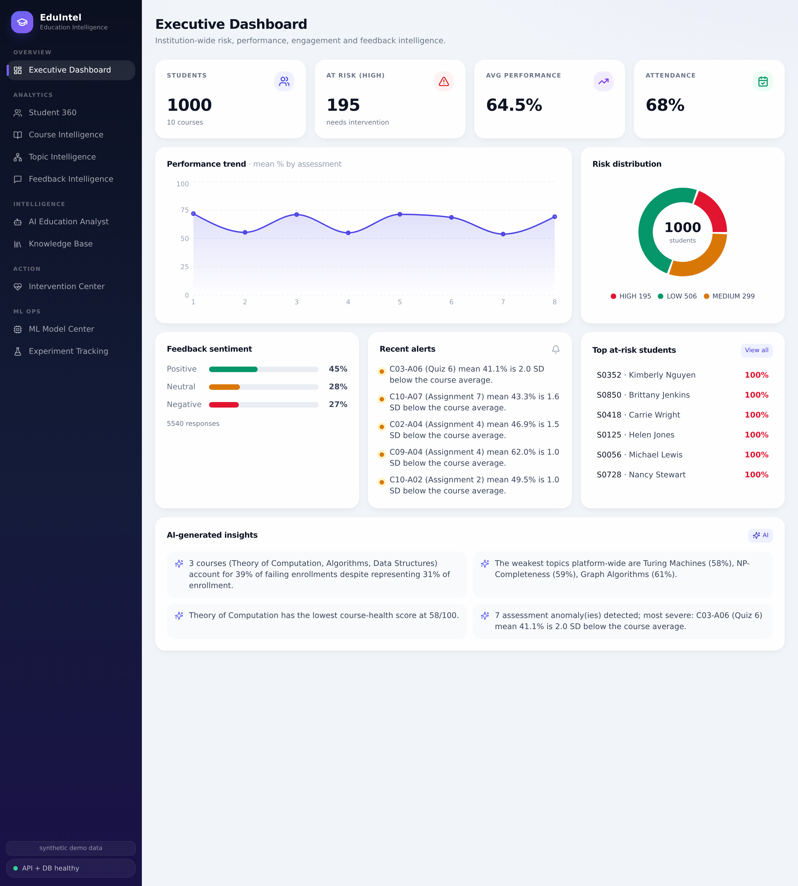
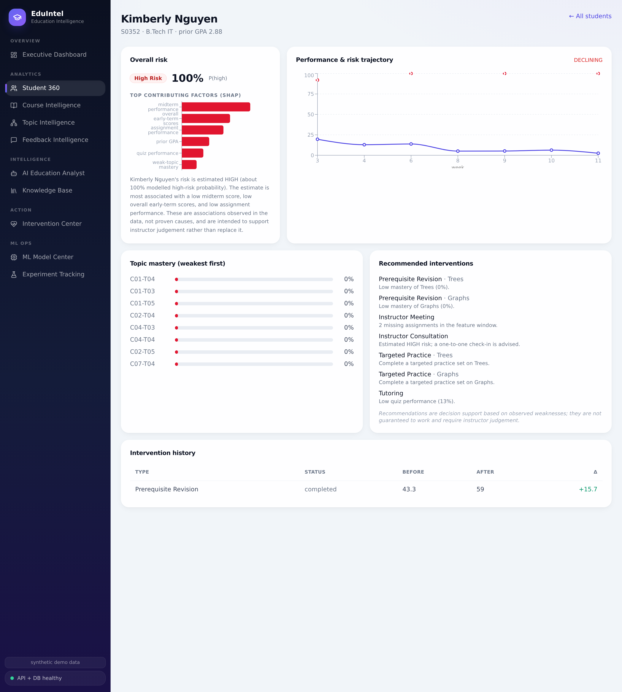

# EduIntel — AI-Powered Education Intelligence & Intervention Platform

> **Don't just predict. Explain, retrieve evidence, recommend an action, and measure the outcome.**

EduIntel is an end-to-end platform that turns raw academic data into actionable
intelligence for colleges, universities and EdTech organisations. It predicts
student risk, **explains** the factors behind every prediction (SHAP), **retrieves
supporting evidence** from course materials and feedback (RAG over pgvector),
**recommends** interventions keyed to each student's weaknesses, and **tracks**
their measured outcomes — combining classical ML, deep-learning NLP, statistics,
time-series analysis, explainable AI, LLMs, vector search and a production-style
FastAPI + React + PostgreSQL stack.

> **Data notice.** The platform ships with a documented, fully **synthetic**
> dataset generator. Synthetic data is used by default and clearly separated from
> any real data. See [Limitations & ethics](docs/ethics-and-limitations.md).

---

## 1. Problem statement

Institutions can see grades *after* the fact but struggle to act *early*. The
questions that matter — who is at risk, **why**, which topics to reteach, what
students are complaining about, what intervention to try, and whether it worked —
require joining performance, attendance, assessment, feedback and course-material
data and layering ML, NLP and retrieval on top. EduIntel answers them as an
early-warning **decision-support** system for instructors (never an automated
decision-maker).

## 2. What it does

- **Student risk engine** — LOW/MEDIUM/HIGH risk from 16 leakage-safe features.
- **Explainability** — per-prediction SHAP factors + natural-language, non-causal explanations.
- **Learning trajectory** — score/attendance/mastery time series + a model-computed risk trajectory.
- **Topic intelligence** — topic mastery, weak-topic detection, Course→Topic→Student drilldown.
- **Feedback NLP** — sentiment/topic/issue/severity via rule / transformer / LLM, compared.
- **RAG knowledge base** — upload material; semantic search with citations and insufficient-evidence detection.
- **AI Education Analyst** — grounded, cited answers that never invent numbers.
- **Intervention engine** — weakness-keyed recommendations, recording, before/after effectiveness.
- **Analytics & BI** — transparent course-health, anomaly detection, data quality, computed insights, automated reports.
- **MLOps** — experiment tracking, model registry/versioning, reproducible training.

## 3. Architecture

Full diagrams in [docs/architecture.md](docs/architecture.md). In brief: a React
SPA calls a layered FastAPI backend (routes → services/analytics/ml/nlp/rag/analyst)
over PostgreSQL 16 + pgvector, with a provider-agnostic LLM abstraction and an
embedding abstraction that both degrade gracefully offline.

## 4. Tech stack

| Layer | Technology |
|------|-----------|
| Backend | Python 3.11, FastAPI, Pydantic v2, SQLAlchemy 2.0 |
| Database | PostgreSQL 16 + pgvector (HNSW) |
| ML | scikit-learn, XGBoost, SHAP, Optuna, SciPy, statsmodels |
| NLP / LLM | sentence-transformers, Transformers (DistilBERT), Gemini (pluggable) |
| Frontend | React 18, TypeScript, Tailwind CSS, Recharts |
| Ops | Docker, Docker Compose, structured logging, Alembic, MLflow (optional) |

## 5. Documentation map

| Topic | Doc |
|------|-----|
| Architecture + diagrams | [docs/architecture.md](docs/architecture.md) |
| ML methodology | [docs/ml-methodology.md](docs/ml-methodology.md) |
| **ML experiment report (results)** | [docs/experiment-report.md](docs/experiment-report.md) |
| How leakage is prevented | [docs/leakage-prevention.md](docs/leakage-prevention.md) |
| RAG & NLP architecture | [docs/rag-nlp.md](docs/rag-nlp.md) |
| Database schema | [docs/database.md](docs/database.md) |
| API reference | [docs/api.md](docs/api.md) |
| Ethics & limitations | [docs/ethics-and-limitations.md](docs/ethics-and-limitations.md) |

## 6. Headline results

Held-out test set, seed 42 (reproduce: `python scripts/train.py`). Full table in
the [experiment report](docs/experiment-report.md).

| Model | Macro-F1 | ROC-AUC | HIGH recall | HIGH→LOW errors |
|------|:--:|:--:|:--:|:--:|
| **Logistic Regression** (selected) | 0.827 | 0.962 | 0.769 | **0** |
| Random Forest | 0.800 | 0.956 | 0.692 | 0 |
| XGBoost (+Optuna) | 0.791 | 0.953 | 0.718 | 0 |

**No HIGH-risk student was ever misclassified as LOW-risk** — the costliest error
for an intervention system. Feature engineering added +0.024 macro-F1 (ablation).

## 7. Screenshots


_Executive Dashboard — KPIs, performance trend, risk distribution, feedback sentiment, live anomaly alerts, computed insights._


_Student 360 — risk + SHAP factors, performance & risk trajectory, topic mastery, weakness-keyed interventions with measured outcomes._

## 8. Quickstart (Docker)

```bash
cp .env.example .env          # optionally add GEMINI_API_KEY
docker compose up --build     # db + backend + frontend
# One-time demo setup (data → train → ingest → feedback → interventions):
docker compose exec backend python scripts/bootstrap.py
# Backend docs: http://localhost:8000/docs   ·   Frontend: http://localhost:8080
```

## 9. Local development

```bash
# 1) Postgres with pgvector (Docker is easiest):
docker run -d --name eduintel-db -p 5432:5432 \
  -e POSTGRES_USER=eduintel -e POSTGRES_PASSWORD=eduintel -e POSTGRES_DB=eduintel \
  pgvector/pgvector:pg16

# 2) Backend
cd backend
python -m venv .venv && source .venv/bin/activate
pip install -r requirements-dev.txt
cd .. && cp .env.example .env          # add DATABASE_URL / GEMINI_API_KEY if desired
python scripts/bootstrap.py            # or: make bootstrap
cd backend && uvicorn app.main:app --reload

# 3) Frontend
cd frontend && npm install && npm run dev   # http://localhost:5173 (proxies /api to :8000)
```

Common tasks are wrapped in the **Makefile** (`make bootstrap`, `make test`,
`make backend`, `make frontend`, `make up`).

## Deploy to a live URL

Push to GitHub and deploy on **Render** (one web service + managed Postgres,
pre-configured in [`render.yaml`](render.yaml) and
[`deploy/Dockerfile`](deploy/Dockerfile) — the backend serves the built React app,
so it's a single service). Step-by-step guide:
**[docs/deploy-render.md](docs/deploy-render.md)**.

## 10. Environment variables

See [`.env.example`](.env.example). Key ones: `DATABASE_URL` (or the discrete
`POSTGRES_*`), `LLM_PROVIDER` (`gemini|openai|local`), `GEMINI_API_KEY`,
`EMBEDDING_MODEL_NAME`, `RANDOM_SEED`, `API_KEY` (enables the auth gate).
Secrets live only in `.env` (gitignored) — never in source.

## 11. Project structure

```
eduintel/
├── backend/   FastAPI app (api, core, db, models, schemas, services, ml, nlp, rag, analyst, llm) + tests + alembic
├── frontend/  React + TS + Tailwind SPA (12 views)
├── scripts/   generate_data · validate_data · seed · train · explain · ingest_docs · analyze_feedback · seed_interventions · bootstrap
├── data/ · models/ · docker/ · docs/
└── docker-compose.yml · Makefile · README.md
```

## 12. Testing

```bash
make test        # 30 pytest tests: unit (features incl. leakage test, embeddings,
                 # chunking, NLP, evaluation) + API/RAG/analyst integration + edge cases
```

## 13. Limitations & responsible use

The shipped data is synthetic; the system is decision **support**, not an
automated decision-maker; explanations are associative, not causal; intervention
effectiveness is observational (no control group). Full treatment, including bias
and privacy, in [docs/ethics-and-limitations.md](docs/ethics-and-limitations.md).

## 14. Future work

Multimodal PDF tables/images; voice interface for the analyst; automated
presentation generation; a tool-using agent; what-if scenario simulation;
early-warning alerting; cross-cohort chronological training and drift monitoring.

## Build status (phased delivery)

- [x] **Phase 1** — Scaffold, DB schema (20 tables + pgvector), Docker, API skeleton
- [x] **Phase 2** — Synthetic data generator (latent-variable model) + validator + COPY seeder
- [x] **Phase 3** — Analytics: course health, topic intelligence, anomaly detection, data quality, feedback aggregation, BI insights
- [x] **Phase 4** — Student-risk ML: 16 features, model comparison, metrics, calibration, false-negative analysis, ablation, Optuna, experiment tracking, registry, serving
- [x] **Phase 5** — Explainable AI: SHAP + non-causal NL explanations
- [x] **Phase 6** — Time-series & trajectory (incl. model-computed risk trajectory)
- [x] **Phase 7** — Feedback NLP (rule/transformer/LLM, compared) + LLM abstraction
- [x] **Phase 8** — RAG knowledge base (chunk → embed → pgvector HNSW → retrieve → cite)
- [x] **Phase 9** — AI Education Analyst (grounded, cited, insufficient-evidence) + weekly report
- [x] **Phase 10** — Intervention engine & effectiveness tracking
- [x] **Phase 11** — React dashboard (12 views)
- [x] **Phase 12** — Testing (30 tests)
- [x] **Phase 13** — Dockerization & MLOps
- [x] **Phase 14** — Documentation
- [x] **Phase 15** — Deployment prep & final verification

## License

MIT — see [LICENSE](LICENSE).
