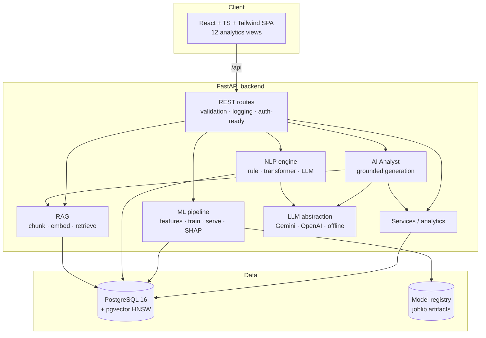
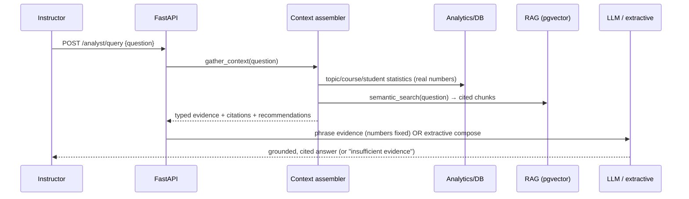

# Architecture

EduIntel is a monorepo with a FastAPI backend, a React/TypeScript frontend, and
a PostgreSQL + pgvector database. The backend is layered so business logic (ML,
NLP, RAG, analytics) is independent of the API and the ORM.

## System overview

## Request lifecycle (AI Analyst example)

## Backend layering

| Layer | Package | Responsibility |
|------|---------|----------------|
| API | `app/api` | Routing, request/response schemas, validation, error handling |
| Core | `app/core` | Config (env), structured logging, security primitives |
| Models | `app/models` | SQLAlchemy ORM (20 tables) |
| Analytics | `app/analytics` | Course health, topics, anomalies, data quality, dashboard, insights, trajectory |
| ML | `app/ml` | Feature engineering, training, evaluation, registry, serving, SHAP |
| NLP | `app/nlp` | Feedback sentiment/issue extraction (3 methods) |
| RAG | `app/rag` | Embeddings, chunking, ingestion, retrieval |
| Analyst | `app/analyst` | Evidence assembly, grounded generation, reports |
| LLM | `app/llm` | Provider-agnostic LLM abstraction |
| Services | `app/services` | Intervention recommendation/tracking |

## Design principles

- **Separation of concerns** — routes never contain business logic; ML/NLP/RAG
  code has no FastAPI dependency and is unit-testable in isolation.
- **Provider independence** — the app depends on an `LLMProvider` interface and
  an `EmbeddingModel` abstraction, never on a specific vendor SDK.
- **Graceful degradation** — every external dependency (LLM API, transformer
  weights) has an offline fallback, so the platform runs end-to-end with no keys.
- **Traceability** — predictions link to a `model_version`; analyst numbers link
  to their analytics source; RAG answers link to document chunks.
