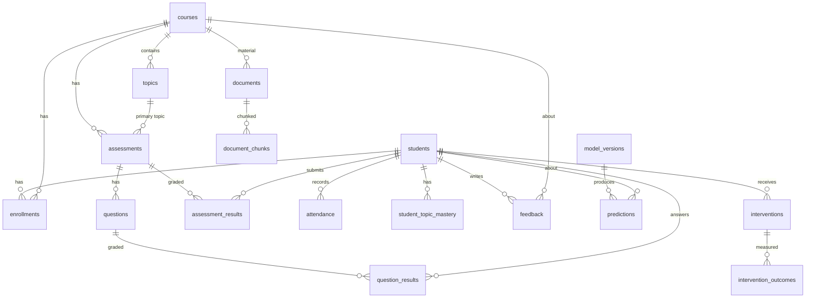

# Database Schema

PostgreSQL 16 with the pgvector extension. 20 tables with foreign keys and
indexes; embeddings stored in a `vector(384)` column with an HNSW index.

## Core relationships

## Tables

| Table | Purpose | Key columns |
|------|---------|-------------|
| `students` | Student records (PII-minimized) | id, name, program, prev_gpa |
| `courses` | Course catalogue | id, code, title, difficulty, instructor_name |
| `topics` | Topics per course | id, course_id, sequence, difficulty |
| `enrollments` | Student↔course, term outcome | student_id, course_id, final_grade* |
| `assessments` | Quizzes/assignments/exams | id, course_id, topic_id, kind, sequence, weight |
| `questions` | Per-assessment questions | assessment_id, topic_id, difficulty |
| `assessment_results` | Per-student assessment scores | student_id, assessment_id, percentage, is_missing, submission_delay_hours |
| `question_results` | Per-question outcomes (drilldown) | student_id, question_id, correct |
| `attendance` | Per-session attendance | student_id, course_id, week, status |
| `student_topic_mastery` | Derived topic mastery | student_id, topic_id, mastery |
| `feedback` | Student feedback + NLP fields | text, rating, sentiment, topics, issues |
| `documents` | RAG source documents | title, doc_type, course_id |
| `document_chunks` | Embedded chunks | content, page, topic, **embedding vector(384)** |
| `predictions` | Stored risk predictions | student_id, model_version_id, risk_label, shap_values |
| `model_versions` | Registered models | version, model_type, metrics, status |
| `experiments` | Training runs | model_type, feature_set, metrics, seed |
| `interventions` | Recommended/recorded actions | student_id, type, reason, status |
| `intervention_outcomes` | Before/after measurement | before_value, after_value, delta |
| `alerts` | Early-warning alerts | scope, severity, message |
| `audit_logs` | Audit-friendly action log | actor, action, resource |

\* `final_grade` is a term **outcome** and is deliberately never used as a model
feature (see [leakage-prevention.md](leakage-prevention.md)).

## Design notes

- **Business keys** (`students.id = "S0001"`, `courses.id = "C01"`,
  `topics.id = "C01-T05"`, `assessments.id = "C01-A05"`) are readable and make
  citations and API paths natural; high-volume child tables use integer PKs.
- **Indexes** on all foreign keys and hot query paths; unique indexes prevent
  duplicate results/mastery rows.
- **pgvector HNSW** index on `document_chunks.embedding` for fast cosine search.
- **Migrations** via Alembic (`backend/alembic/`); the demo uses `init_db` for a
  one-command spin-up.
