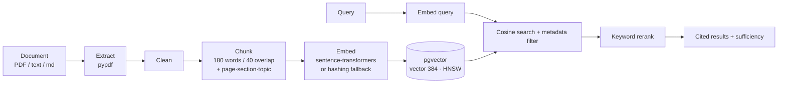

# RAG & NLP Architecture

## RAG pipeline

### Chunking & metadata
Documents are split into overlapping word windows (180 words, 40 overlap). Each
chunk stores `document_id`, `course_id`, `document_type`, `page`, `section`,
`topic`, and `chunk_index`, so retrieval can filter and every result carries a
precise citation (`[Course - Lecture Notes, p.5]`).

### Embeddings
`EmbeddingModel` loads **sentence-transformers `all-MiniLM-L6-v2` (384-dim)** as
the primary encoder. When the weights cannot be loaded (offline), it falls back
to a **deterministic feature-hashing embedding** of the same dimension, so the
whole pipeline — including pgvector cosine search — stays functional and
reproducible. Both produce L2-normalised vectors.

### Vector index
Chunks are stored in a pgvector `vector(384)` column with an **HNSW** index
(`vector_cosine_ops`). HNSW is chosen over IVFFlat because it needs no training
set (correct even when built before ingestion) and gives near-exact recall at
the demo's scale.

### Retrieval, reranking, sufficiency
A query embedding is compared by cosine distance with optional metadata filters
(`course_id`, `topic`, `doc_type`). A wider candidate set is **reranked** by a
combined score `0.75·cosine + 0.25·keyword-overlap` (stopword-filtered). The
response reports `best_similarity` and a `sufficient` flag; if nothing clears the
similarity floor (and, on the offline embeddings, lacks genuine lexical overlap),
the system returns **insufficient evidence** rather than a low-quality match.

### Hallucination prevention
The AI Analyst never lets the LLM invent numbers. All figures are computed by the
analytics layer and passed as typed evidence; the LLM only phrases them and cites
the provided sources. When there is no supporting evidence, the analyst declines.
An offline **extractive** path composes the answer directly from the evidence, so
groundedness does not depend on the LLM.

## NLP engine

Feedback is analysed by three interchangeable methods sharing one output schema
(`sentiment`, `sentiment_score`, `topics`, `issues`, `severity`, `aspect`):

| Method | Sentiment | Topics / issues | Notes |
|------|-----------|-----------------|-------|
| `rule` | lexicon polarity | keyword lexicon | fully offline, fast |
| `transformer` | DistilBERT SST-2 | keyword lexicon | lazy-loaded weights |
| `llm` | LLM JSON classification | LLM | via the LLM abstraction |

Transformer and LLM fall back to the rule method when weights/keys are
unavailable, and the `method` field records which actually ran.

### Method comparison
Because there is no gold sentiment label, the student's own **star rating** is
used as proxy ground truth (`≥4 positive, ≤2 negative, else neutral`).
`compare_methods` reports each method's accuracy against that proxy plus pairwise
agreement — quantifying the comparison rather than merely describing it.
